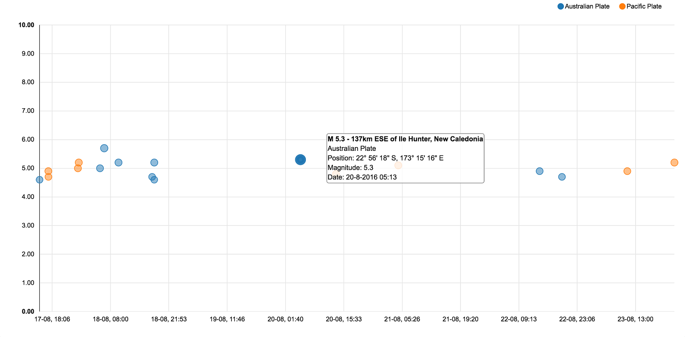

# Earthquake watcher

Earthquake watcher allows to analyze the behavior of earthquakes of different areas, in different period of time. In particular you can locate earthquakes in real-time, compare their strength and get an idea of the seismicity.
To have a full view data can be visualized in different ways using:

### Dot distribution map
Shows an indicator where the earthquakes occurred.

### Distribution map
Shows indicators of different size and color depending on the magnitude of the earthquakes.

### Heatmap
Shows the seismicity of the analyzed area using an heatmap.

### Timeline
Shows the behaviour the analyzed area, in particular you can analyze the number of earthquakes happened in a specific range of time, comparing their strength and the gap between them.

## Data source

Data are fetched in real time from USGS Hazard program, using the provided [API](http://earthquake.usgs.gov/fdsnws/event/1/) using the [GeoJSON](http://geojson.org) format.
It is then possible to specify a range of magnitude/time to consider in order to analyze only data you are looking for. Earthquakes information retrieved also contain a link to the main page provided by USGS.
